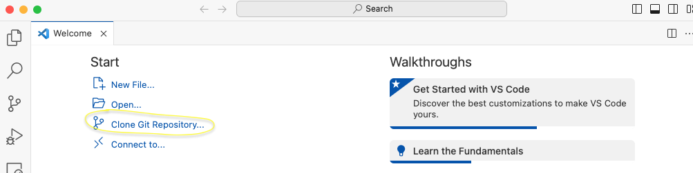
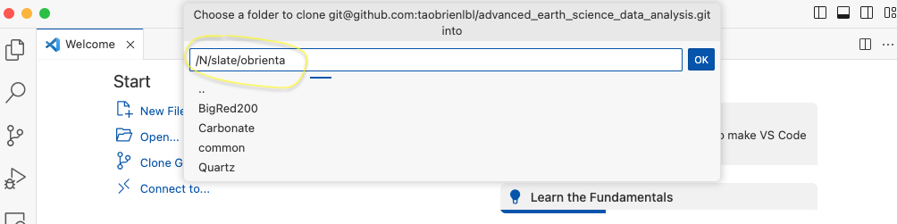

# COMPLETE | Homework 08a

**Goal:** get set up with IU supercomputing accounts in advance of our labs and assignments on parallel programming.

**Caution:** Follow all instructions carefully.  Your grade for this assignment will be reduced if instructions are not followed.

## Account and VS Code Setup
1. Create UITS accounts for the following (see [this link](https://kb.iu.edu/d/achr)):
    * Big Red 200
    * Quartz
    * Slate
    * Slate-Project
1. (optional $^*$) Set up passwordless login:
    * https://kb.iu.edu/d/aews
    * ["SSH public key authentication to HPS systems" agreement](https://hpceverywhere.iu.edu/forms/agree?_gl=1*cxl9lp*_ga*MTI1NDQ3ODYxNi4xNjk2OTY2NzM1*_ga_61CH0D2DQW*MTY5NzQ3MDc4OC4zLjEuMTY5NzQ3MTU3NC41OS4wLjA.)
1. Set up `bigred200.uits.iu.edu` in Visual Stuio Code: https://code.visualstudio.com/docs/remote/ssh

$^*$ passwordless login is highly recommended. If you choose not to follow this step, you will have to enter your IU password *many* times on each day that we use UITS supercomputing systems.

## Setting up your git environment
1. Connect to `bigred200.uits.iu.edu` with Visual Stuio code.
    * When it asks you what type of system (Linux, Windows, etc.), select 'Linux' - it's asking about the type of system that you're logging in to
    * When you connect to bigred200 for the first time, make sure to enter your UITS username, i.e. `ssh YOURUSERNAME@bigred200.uits.iu.edu -A`
1. Clone your course repository into `/N/slate/YOURUSERNAME` (replace `YOURUSERNAME` with your UITS username)

1. Open [a terminal in VS Code](https://code.visualstudio.com/docs/terminal/basics)
    * Type the following command in the terminal and hit the *Enter* key: `pwd`
    * copy what is output, and send the result to Travis in slack

If you encounter problems, send a message on the `#general` channel at https://iubeartscidat-kw95374.slack.com.

## Setting up a conda environment

(all commands that `appear like this` are intended to be typed into the terminal, followed by the *Enter* key)

1. Make a Downloads directory: `mkdir -p ~/Downloads` (the `~` symbol is short hand for `/home/YOURUSERNAME`)
1. Go to your Downloads directory: `pushd ~/Downloads`
1. Download micromamba: `wget https://github.com/conda-forge/miniforge/releases/latest/download/Miniforge3-Linux-x86_64.sh`
1. Run the micromamba install: `bash Miniforge3-Linux-x86_64.sh`

    * Right after it asks you to accept the license terms, it will ask where to install
    * DO NOT install to the default location
    * Instead, install to `/N/slate/YOURUSERNAME/software/bigred200/miniforge3`
    * see this gif for the complete install (note the install was done on quartz, not bigred200, but the steps are identical execpt for the install directory name)
    
1. Close vscode and reconnect to bigred200
1. Prevent miniconda from automatically activating: `conda config --set auto_activate_base false`
1. Activate your base conda environment `mamba activate`
1. Create a new easg690 environment: `mamba create -n easg690 python=3.11 --yes` (note we are using python 3.11 for this exercise)
1. Activate your new environment: `mamba activate easg690`
1. Download the class `requirements.yml` file: `wget https://raw.githubusercontent.com/taobrienlbl/advanced_earth_science_data_analysis/spring_2023_iub/lessons/06_advanced_plotting/requirements.yml`
1. Install the base packages: `mamba env update -f requirements.yml`
1. Install the jupyter kernel into the environment: `ipython kernel install --name easg690 --user`
1. Install `mpi4py` using the system MPI library: `MPICC="cc -shared" python3 -m pip install --force --no-binary=mpi4py mpi4py` 

If you encounter problems, send a message on the `#general` channel at https://iubeartscidat-kw95374.slack.com.

